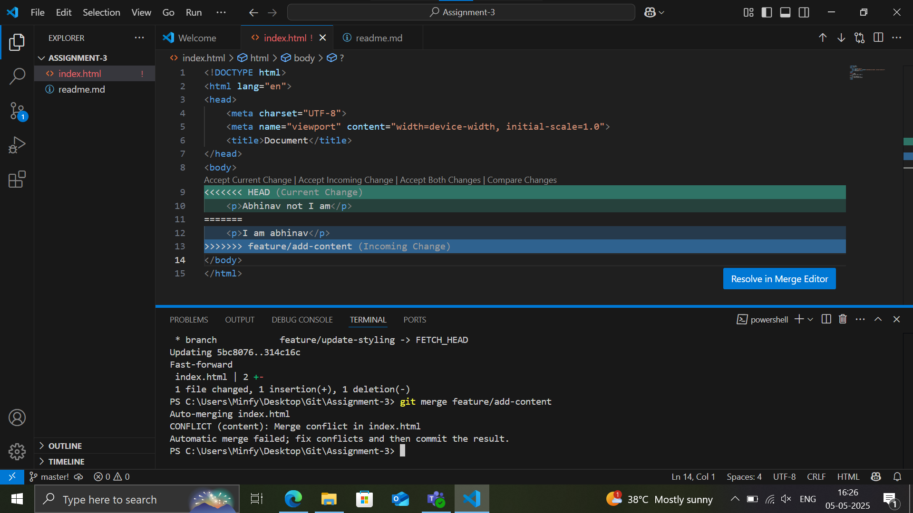
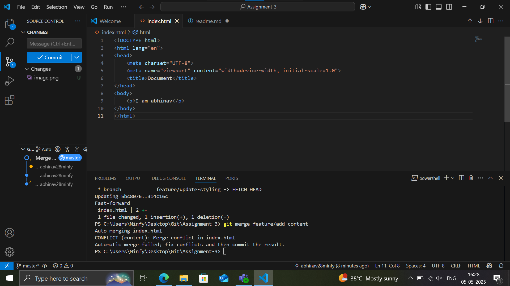

1. Merge conflict-> 

2. After Merging-> 

3. Repo Link-> https://github.com/abhinav28minfy/Assignment-3_git.git

Brief Summary->

Generated a basic boiler-plate html code in master branch.
Created 2 branches: feature/update-styling, feature/add-content.
Modified the body contenyt in both of the branches.
Pulled feature/update-styling in the master branch.
Merged the feature/add-content into the master branch.
A merged conflict occured due to the diffing body tags.
Reviewd the branch content and, finazed the specific content required to be addded.
Performed a complete merge and pushed the changes onto the remote repository.